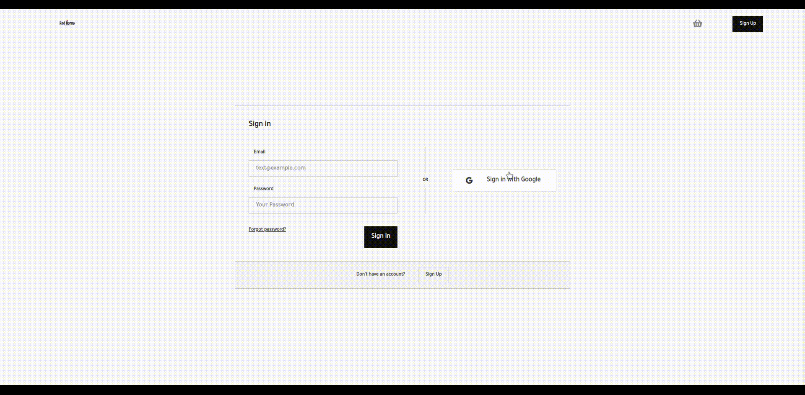

ecommerce-react-master

To run the project 1.npm install 2.npm run dev

Create an e-commerce site using React and database of your choice.
    • The site should have the following pages
        ◦ Home Page which lists out products from different categories with search column on left. The search column should include, search by name ( input ) and search by category.
        ◦ Product pages ( detailed product description with image, price and add to cart button )
        ◦ Cart/Checkout page.
    • No need for a working payment gateway integration.
    • Pages should be rendered on the server ( may use express-js )
    • Items should be stored in the database but a UI for adding new items is optional and may be skipped to save time.
    
